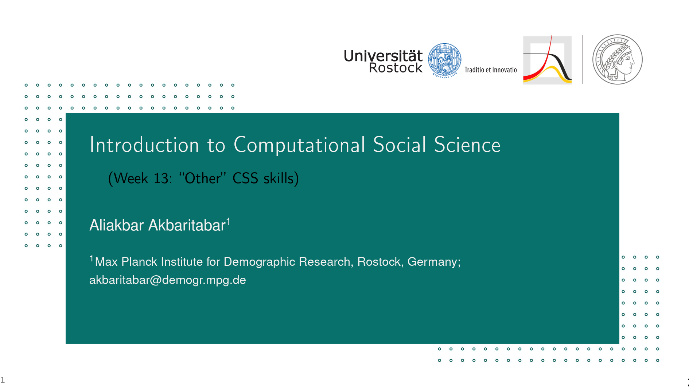
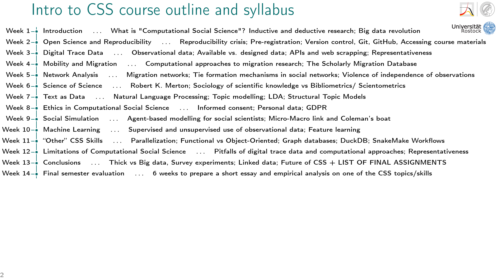
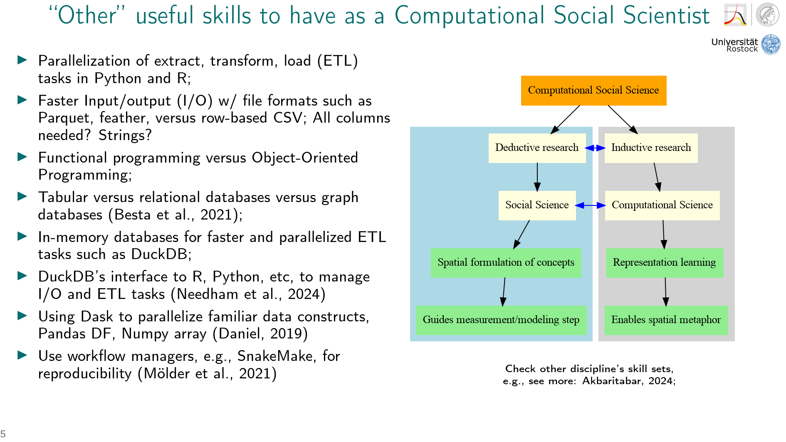

# Materials for course on ""Other" Computational Social Science Skills" at the fourth MPIDR Summer Incubator Program, June 10, 2025, Rostock, Germany (and online)

Here is the folder structure and what to expect:

- Root folder
    - This ReadMe.md text file and other files for license etc.
- Slides
    - Open the PDF of slides and follow the steps described to know how to use the files in this repository for Hands-on part, and introduction to concepts presented in practical examples.
    - Slides also include instructions on what software to install for Hands-on part
- Hands_on
    - Includes scripts in R, Python, and SQL using DuckDB with toy data and larger dataset to download from internet

**Note and disclaimer**: I will only share leads, links, and show you "example" scripts in R, Python, and SQL in this introductory short session; you would need to extend them on your own.

## Preview of slides and course structure

